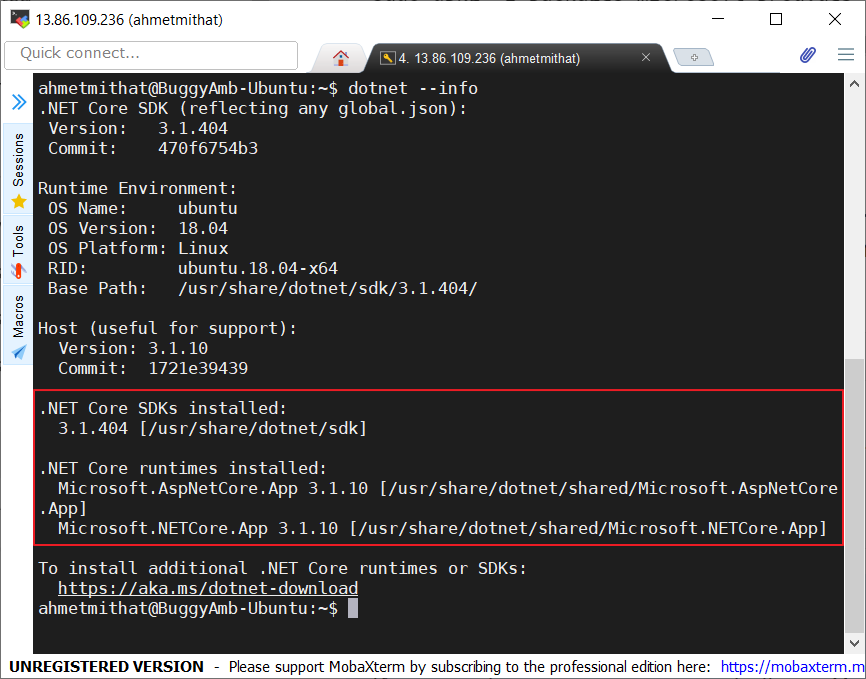
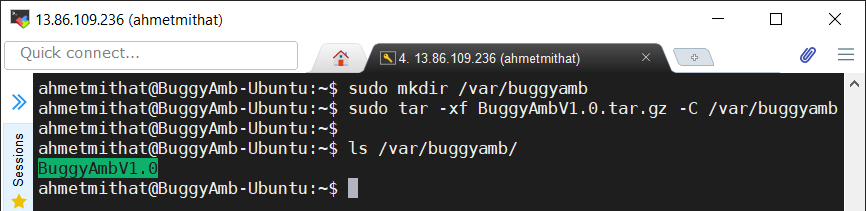
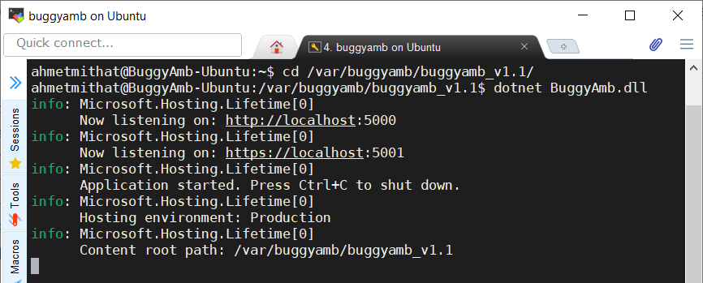
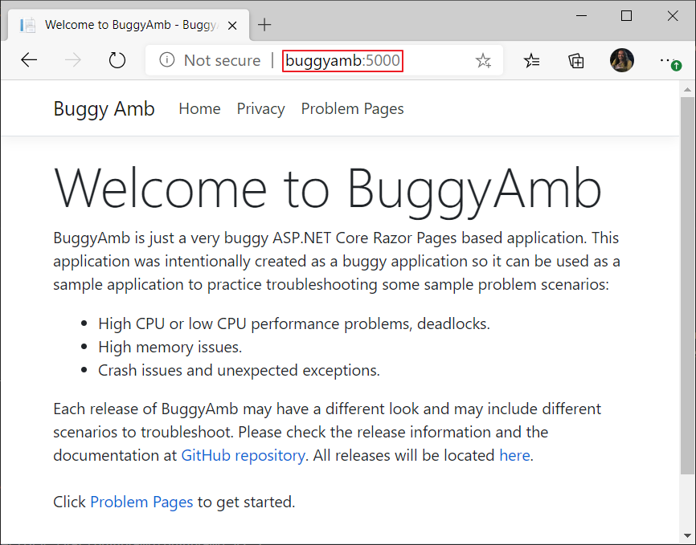
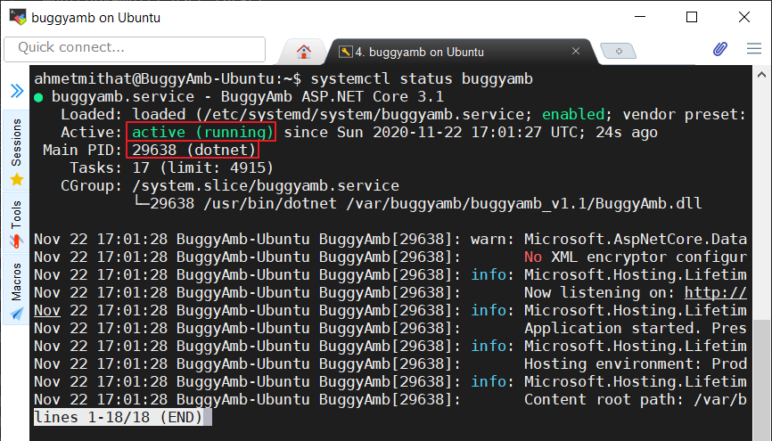

<h1>Linux Installation Instructions</h1>

* <a href="#net-core-version">.NET Core version</a>
* <a href="#how-to-run-buggyamb">How to run BuggyAmb</a>
    * <a href="#running-buggyamb-as-a-standalone-application-no-web-server-is-needed">Running BuggyAmb as a standalone application (no web server is needed)</a>
    * <a href="#running-buggyamb-behind-a-web-server-nginx-apache)">Running BuggyAmb behind a web server (Nginx or Apache)</a>

<h2>.NET Core version</h2>

BuggyAmb is an ASP.NET Core <code>framework-dependent</code> application so it means that the correct version of ASP.NET Core runtime should be installed on your machine.

The main reason for not publishing BuggyAmb as a self-contained application is simple: the size of the package will be much higher than the framework-dependent one when it is deployed as self-contained application because the required .NET Core libraries will also be included in the deployment package. If you want to deploy BuggyAmb as a self-contained application then you can download the source code and publish like that.

Please check the release information to find out which .NET Core version is required to run that release. The initial release of BuggyAmb is an ASP.NET Core 3.1 application so you will need .NET Core 3.1 runtime or SDK. You can run the following command on a terminal to see which versions are installed on your machine:

> dotnet --info

If you don't have ASP.NET Core 3.1 runtime or SDK on your machine then you can find the installation instructions for different Linux distributions in this page: https://docs.microsoft.com/en-us/dotnet/core/install/linux

I have installed the .NET Core 3.1 SDK on Ubuntu 18.04 by following the instructions on https://docs.microsoft.com/en-us/dotnet/core/install/linux-ubuntu#1804 and replacing the dotnet-sdk-5.0 with dotnet-sdk-3.1:

>sudo apt-get update; \
>  sudo apt-get install -y apt-transport-https && \
>  sudo apt-get update && \
>  sudo apt-get install -y <b>dotnet-sdk-3.1</b>

And here is the <code>dotnet --info</code> output:

<h2>Downloading the BuggyAmb in Linux</h2>

Simply you can run the following <code>wget</code> command to download BuggyAmb bits on your Linux machine:

>wget https://github.com/ahmetmithat/buggyamb/releases/download/v1.1/buggyamb_v1.1.tar.gz

Note that the command above downloads the first release of BuggyAmb and actually as of now it is the only release available :smiley:

After the BuggyAmb is downloaded you need to extract the tar.gz file. The file should be downloaded in the current folder you are in when running the <code>wget</code> command and now you need to use <code>tar</code> to extract the file. I chose extracting the all releases under <code>/var/buggyamb</code> directory so I use the following command to extract:

>sudo mkdir /var/buggyamb \
>sudo tar -xf buggyamb_v1.1.tar.gz -C /var/buggyamb

The <code>buggyamb_v1.1</code> folder should have been created under <code>/var/buggyamb</code>:

<h2>How to run BuggyAmb</h2>

The first release of BuggyAmb runs over HTTP. If you need to configure it to run on HTTPS then you can download the source code and make the necessary changes based on your needs. 

You need to run BuggyAmb as a standalone application in Linux, there is no "in-process" hosting model for ASP.NET Core applications in Linux unlike what IIS offers when run on Windows.

To run BuggyAmb on Linux:

* Change directory to where BuggyAmb is extracted. In my case I change the directory to <code>/var/buggyamb/buggyamb_v1.1</code>
* And run the following command: <code>dotnet BuggyAmb.dll</code>

You should see that the application is listening on port 5000 for HTTP requests:

Now you can test if it works. Open a browser and make a request to BuggyAmb, you should see the BuggyAmb Welcome Page:

Needless to say, "buggyamb" hostname resolves the IP address of my Linux machine and the port 5000 is the port where BuggyAmb listens on.

>This should be enough to get started with troubleshooting. You can start playing around problem scenarios and troubleshoot it. For a quick guide for the problematic scenarios and some troubleshooting tips, you can visi the "<a href="quick_tour.md">quick tour</a>".

<h2>Ensuring BuggyAmb runs always</h2>

So far, if you are able to access the home page of BuggyAmb, then you are ready to start with troubleshooting. However if you restart the Linux machine or BuggyAmb crashes (and believe it is a buggy application and it crashes a lot), then you should start it manually by running the <code>dotnet BuggyAmb.dll</code> command. In a real world scenario you want applications to start automatically after a crash or reboot.

If you host an ASP.NET Core application on IIS, either in-process or out-process, IIS manages the process startups. In Linux, you can use <code>systemd</code> to manage the same. As described in https://docs.microsoft.com/en-us/aspnet/core/host-and-deploy/linux-nginx?view=aspnetcore-3.1;

 >systemd is an init system that provides many powerful features for starting, stopping, and managing processes.

<code>systemd</code> will use a service/unit file to manage an application. This is similar to the service concept in Windows and is called <code>daemons</code> in Linux world. The unit files are located in <code>/etc/systemd/system</code> directory.

Here is a sample Unit file that you can use:

>\[Unit]\
>Description=BuggyAmb ASP.NET Core 3.1\
>\
>\[Service]\
>WorkingDirectory=/var/buggyamb/buggyamb_v1.1\
>ExecStart= /usr/bin/dotnet /var/buggyamb/buggyamb_v1.1/BuggyAmb.dll\
>Restart=always\
>\# Restart service after 10 seconds if the dotnet service crashes:\
>RestartSec=10\
>KillSignal=SIGINT\
>SyslogIdentifier=BuggyAmb\
>User=www-data\
>Environment=ASPNETCORE_ENVIRONMENT=Production\
>\
>\[Install]\
>WantedBy=multi-user.target
</code>

Just create <code>buggyamb.service</code> file in <code>/etc/systemd/system</code> directory, copy and paste the lines above in that file. You can use your favorite text editor, such as <code>nano</code> or <code>vi</code>, e.g.:

>sudo vi /etc/systemd/system/buggyamb.service

Once you create the unit file, reload the daemon configurations so this service will be added in the list:

>sudo systemctl daemon-reload

Now you are ready to enable the service, start and check if it is running. Enabling a service means that the systemd will be aware of this service so it can start it once the machine is rebooted or the process is crashed. To enable the buggyamb service run this command:

>sudo systemctl enable buggyamb

Enabling a service does not start it so you need to start it now - don't worry you won't need to run this command once again unless you explicitly stop the service:

>sudo systemctl start buggyamb

Now check if the service is started:

>sudo systemctl status buggyamb

You should see the service is <code>active (running)</code>:

>The process ID is an important information here because you will need that PID when you trobleshoot BuggyAmb application. You can get the same process ID using other tools like <code>top</code> or <code>htop</code> easily.

Now BuggyAmb is ready to restart if it crashes or if the machine is rebooted.

<h2>Getting rid of port 5000: running BuggyAmb behind Nginx</h2>

