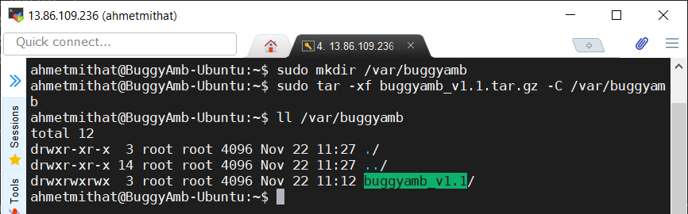

<h1>Linux Installation Instructions</h1>

* <a href="#net-core-version">.NET Core version</a>
* <a href="#how-to-run-buggyamb">How to run BuggyAmb</a>
    * <a href="#running-buggyamb-as-a-standalone-application-no-web-server-is-needed">Running BuggyAmb as a standalone application (no web server is needed)</a>
    * <a href="#running-buggyamb-behind-a-web-server-nginx-apache)">Running BuggyAmb behind a web server (Nginx or Apache)</a>

<h2>.NET Core version</h2>

BuggyAmb is an ASP.NET Core <code>framework-dependent</code> application so it means that the correct version of ASP.NET Core runtime should be installed on your machine.

The main reason for not publishing BuggyAmb as a self-contained application is simple: the size of the package will be much higher than the framework-dependent one when it is deployed as self-contained application because the required .NET Core libraries will also be included in the deployment package. If you want to deploy BuggyAmb as a self-contained application then you can download the source code and publish like that.

Please check the release information to find out which .NET Core version is required to run that release. The initial release of BuggyAmb is an ASP.NET Core 3.1 application so you will need .NET Core 3.1 runtime or SDK. You can run the following command on a terminal to see which versions are installed on your machine:

> dotnet --info

If you don't have ASP.NET Core 3.1 runtime or SDK on your machine then you can find the installation instructions for different Linux distributions in this page: https://docs.microsoft.com/en-us/dotnet/core/install/linux

I have installed the .NET Core 3.1 SDK on Ubuntu 18.04 by following the instructions on https://docs.microsoft.com/en-us/dotnet/core/install/linux-ubuntu#1804 and replacing the dotnet-sdk-5.0 with dotnet-sdk-3.1:

>sudo apt-get update; \
>  sudo apt-get install -y apt-transport-https && \
>  sudo apt-get update && \
>  sudo apt-get install -y <b>dotnet-sdk-3.1</b>

And here is the <code>dotnet --info</code> output:

<h2>Downloading the BuggyAmb in Linux</h2>

Simply you can run the following <code>wget</code> command to download BuggyAmb bits on your Linux machine:

>wget https://github.com/ahmetmithat/buggyamb/releases/download/v1.1/buggyamb_v1.1.tar.gz

Note that the command above downloads the first release of BuggyAmb and actually as of now it is the only release available :smiley:

After the BuggyAmb is downloaded you need to extract the tar.gz file. The file should be downloaded in the current folder you are in when running the <code>wget</code> command and now you need to use <code>tar</code> to extract the file. I chose extracting the all releases under <code>/var/buggyamb</code> directory so I use the following command to extract:

>sudo mkdir /var/buggyamb \
>sudo tar -xf buggyamb_v1.1.tar.gz -C /var/buggyamb

The <code>buggyamb_v1.1</code> folder should have been created under <code>/var/buggyamb</code>:

<h2>How to run BuggyAmb</h2>

The first release of BuggyAmb runs over HTTP. If you need to configure it to run on HTTPS then you can download the source code and make the necessary changes based on your needs. 

You need to run BuggyAmb as a standalone application in Linux, there is no "in-process" hosting model for ASP.NET Core applications in Linux unlike what IIS offers when run on Windows.

To run BuggyAmb on Linux:

* Change directory to where BuggyAmb is extracted. In my case I change the directory to <code>/var/buggyamb/buggyamb_v1.1</code>
* And run the following command: <code>dotnet BuggyAmb.dll</code>

You should see that the application is listening on port 5000 for HTTP requests:

<h2>Ensuring BuggyAmb to run always</h2>

If the machine restarts or the BuggyAmb crashes then you should run it manually. This is of course not what we want. We want to make sure that BuggyAmb is started if it crashes or the machine is restarted so we can use a <code>Unit</code> file as described in https://docs.microsoft.com/en-us/aspnet/core/host-and-deploy/linux-nginx?view=aspnetcore-3.1.

Here is a sample Unit file that you can use:

<code>
[Unit]
Description=BuggyAmb ASP.NET Core 3.1

[Service]
WorkingDirectory=/var/buggyamb/buggyamb_v1.1
ExecStart= /usr/bin/dotnet /var/buggyamb/buggyamb_v1.1/BuggyAmb.dll
Restart=always
# Restart service after 10 seconds if the dotnet service crashes:
RestartSec=10
KillSignal=SIGINT
SyslogIdentifier=BuggyAmb
User=www-data
Environment=ASPNETCORE_ENVIRONMENT=Production

[Install]
WantedBy=multi-user.target
</code>

Create a file with the contents above 

So or you can run it behdind Nginx or Apache web server. Even if you want to run it behind Nginx or Apache, you will still need to run the actual BuggyAmb as a stand-alone application on Linux because 

 unlike IIS hosting, just like you would host it on IIS when running on Windows.

Running as stand alone application is very easy and actually it is the only way  You do not need to deal with installing and configuring the Nginx or Apache. Even if you want to run  In this scenario the BuggyAmb application will run in Kestrel web server implementation to listen on port 5000 to accept the HTTP requests.

* When you run as stand alone, you will need to manage to start BuggyAmb once it stops / crashes.
* Hosting on IIS is usually the preferred way for several people in real world scenarios where the OS is Windows so if you want more close environment to real world scenarios you should choose hosting on IIS.
* IIS (actually the WAS service) will manage the process startups so if BuggyAmb crashes then IIS will start it without you to take action (unless the application is pool is disabled due to Rapid Fail Protection) if you host on IIS.

So make your choice, it is all up to you.

<h3>Running BuggyAmb as a standalone application (no web server is needed)</h3>