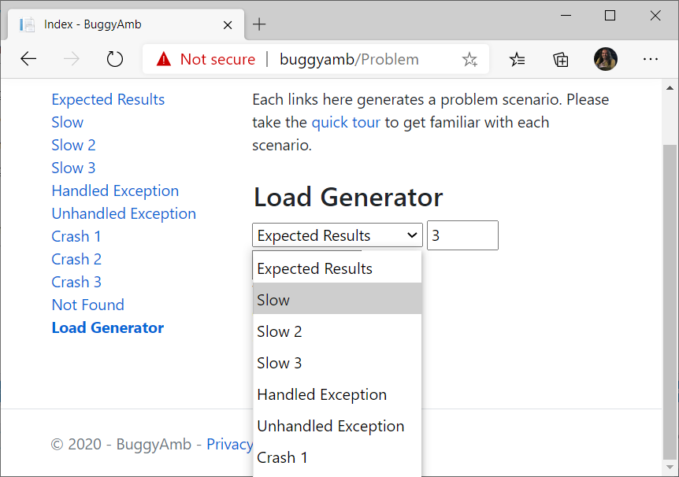
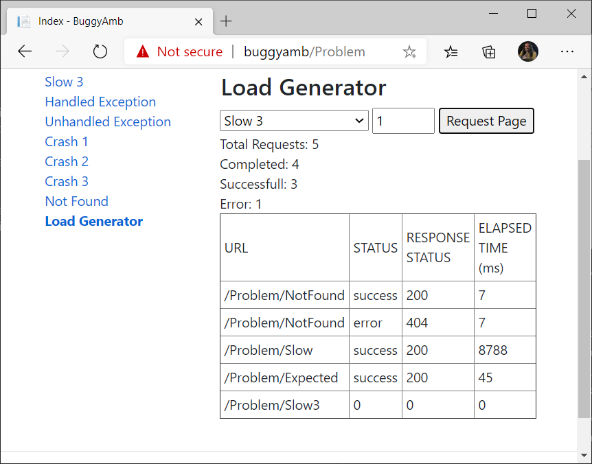
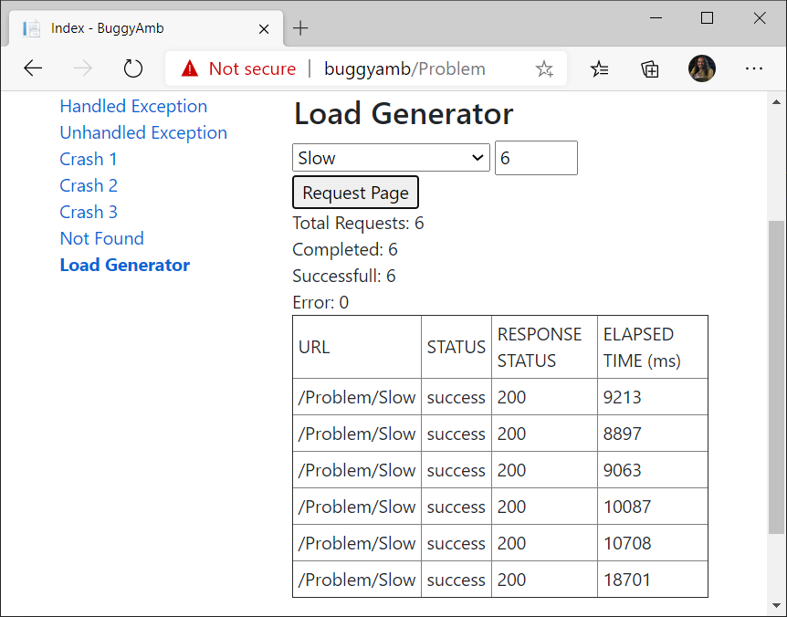
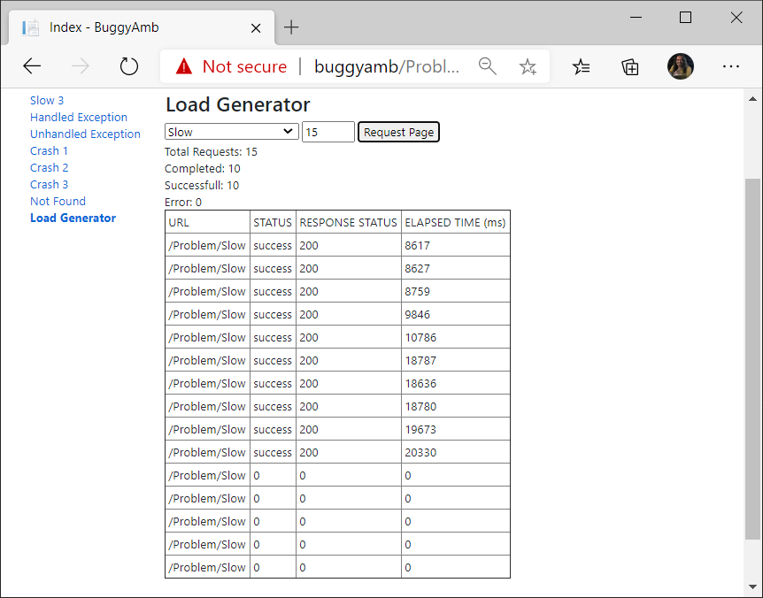

<h1>Experimental "Load Generator"</h1>

"Load Generator" is nothing but some jQuery scripts that can send multiple requests to  different scenarios explained in the <a href="quick_tour.md">quick tour</a>:

It is not a rocket science, just select the page/scenario from list and tell how many requests you want to send there and click Request Page. Load Generator will add those requests in the list and show you if those are running or ended up sucessfully or gave an error. Elapsed time will tell how long it took to get the response:

Screenshot above tells me that there are two requests for <code>/Problem/NotFound</code> page, one is ended up with HTTP 200 and the other one is ended up with HTTP 404. There are two requests for <code>/Problem/Slow</code> and <code>/Problem/Expected</code> pages and both are ended up with HTTP 200 and the slow one took 8 seconds while the expected one took under 1 second. The request for <code>/Problem/Slow3</code> is still not responded. 

>Important: Elapsed Time is the server time + client time. Remember the 6 concurrent Ajax request limit, if you have more than 6 requests still running in the list then the rest will be waiting on the browser's queue for making the actual call. Elapsed Time also counts those seconds / minutes spent in the browser queue while waiting for an available Ajax connection.

>>If, for some reason, you need more requests to test a scenario then there are workarounds: you can open an inPrivate browsing session and can have 6 more concurrent requests. Similarly, you can open one another vendor's browser to have another 6 concurrent request power.

<h2>Sample Usage Scenarios</h2>

<h3>Sending bulk requests to one single page</h3>

I often do this to reproduce the problem with the first slow scenario. If you make one request to the first slow scenario then you will see the page loads slow around 7-8 seconds and sometimes faster where there are lots of CPU resources. In this kind of situations where the response times are higher than expected but not long enough the capture data for troubleshooting (e.g.: capturing multiple dumps with some intervals) it may be difficult to start troubleshooting. So we want to have a larger window to capture data if it is possible.

In this scenario, you would notice that the CPU usage increases whenever a response is made and having more requests make it worse. So we want to send multiple requests. We can open new browser tabs and make the requests manually but why not using a tool to automate that? This is where I use Load Generator:

In the sample below I am sending 6 request to the page running the first slow scenario:

This gives me more time to monitor and troubleshoot the problem.

I know there is that 6 concurrent Ajax request limit in browsers but we can still send more than 6 requests (up to 25) to BuggyAmb in Load Generator. I bet you ask this question: what is the point when, say, 15 requests are sent to BuggyAmb if it just sends only 6 requests at one time? That is correct but keep in mind that browser keeps the requests in the queue when there are 6 Ajax requests and it will send the requests one by one whenever a one of the running requests are done. So the tool will keep sending requests to BuggyAmb and that will give you a lot of time for troubleshotting.

The sample below shows that 15 requests are sent to the the tool:

The first six requests seen in the table are sent first and then four of them are done so the next four requests are sent. Since there are six requests running at the moment, the last five requests will be sent in order once there is an available Ajax connection.

This will give me a lot of time for collecting data.

<b>Again:</b>

>If, for some reason, you need more requests to test a scenario then there are workarounds: you can open an inPrivate browsing session and can have 6 more concurrent requests. Similarly, you can open one another vendor's browser to have another 6 concurrent request power.

<h3>Testing multiple scenarios at the same time</h3>

You may want to mix different scenarios by sending different requests to different parts of BuggyAmb. Below shows that there are six requests made for different scenarios of BuggyAmb and there is still one request being processed, while the rest five done very slow:

Note that I opened an inPrivate browsing session and send requests to slow scenarios before running the above test. As you can see things really get worse when the number of the requests increase.

