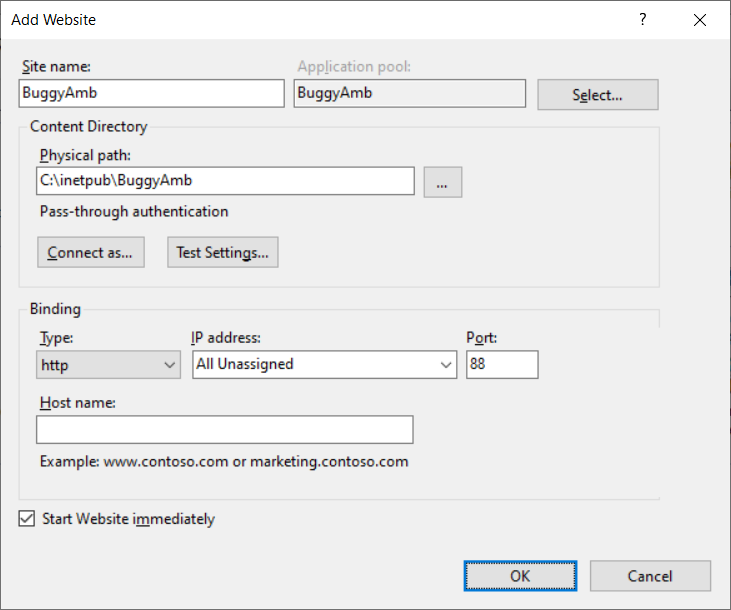
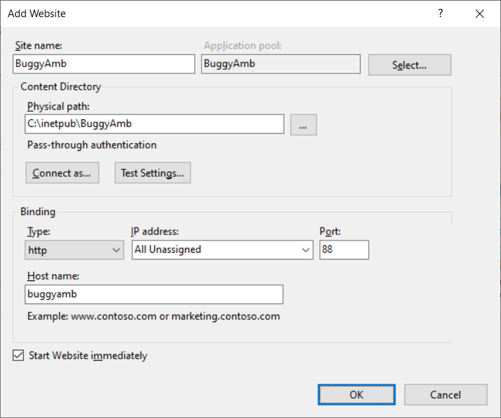
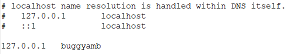
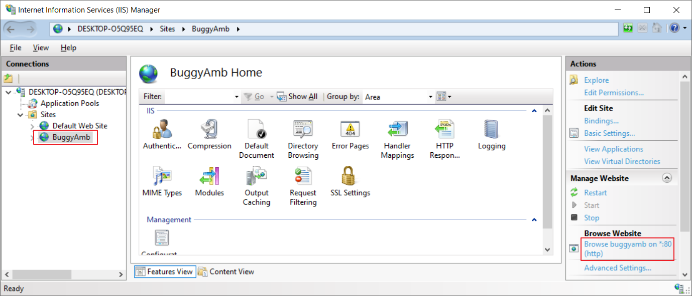
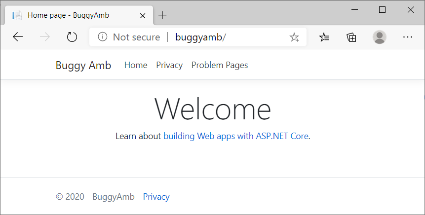

<h1>Quick Tour</h1>

>Applies to: BuggyAmb V1

When you first browse the BuggyAmb application you should see the following Welcome Page:

The problem scenarios are in "Problem Pages". If you click Problem Pages link you will see the following screen:

If you are on a server SKU, such as Windows Server 2019, you can install the IIS by adding the web server role in Server Manager. You can follow the instructions given in https://www.thebestcsharpprogrammerintheworld.com/2016/06/07/lab-1-install-iis-and-create-a-web-site/ if you need help.

After installation is completed you should be able to see the welcome page of IIS when you browse http://localhost/. If you don't get it, then something should be wrong.

<h4>Creating BuggyAmb web site on IIS</h4>

Here are the instructions:

* Download the latest release here: https://github.com/ahmetmithat/buggyamb/releases/
* Extract it to c:\inetpub\BuggyAmb folder.
* Open IIS manager (<code>Start => Run => inetmgr</code>), right click on Sites and choose Add Website to create a new site. You can use similar settings as seen below:

In the sample screenshot above, I create the "BuggyAmb" web site which uses an application pool with the same name. The key part above is the port number: 88. This web site will listen on port 88 for the incoming requests and you will browse http://localhost:88 to access the BuggyAmb application.

If you want to use the default port 80 to avoid putting the port number when making requests, then you can stop the "Default Web Site" which is created when IIS is installed. If you are familiar with IIS configuration then you can keep the Default Web Site running and use a <code>hostname</code> when creating the BuggyAmb site, for example:

In the case above, the requests made via http://buggyamb/ will be routed to this web site. Of course, buggyamb name should resolve the IP address of your machine and you can easily do so by editing the <code>hosts</code> file under <code>C:\Windows\System32\drivers\etc</code> folder:

After clicking OK and creating the web site, you should see it in IIS manager:

Once you create the web site you can test it by either cliking "Browse Website" link in IIS manager or opening a browser and browsing to http://buggyamb. You should see the following:

Note that if you do not configure hostname then you will access to the BuggyAmb web site via http://localhost:88 if you configure the  BuggyAmb web site to run on port 88, or via http://localhost if you stop the Default Web Site and configure the BuggyAmb web site to run on port 80.