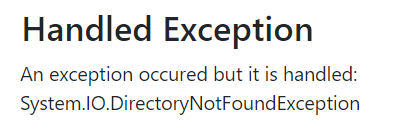

<h1>Quick Tour</h1>

>Applies to: BuggyAmb V1

When you first browse the BuggyAmb application you should see the following Welcome Page:

The problem scenarios are in "Problem Pages". If you click Problem Pages link you will see the following screen:

The <code>content area</code> is where you see the results when you click a link.

Links for the problem scenarios are located on the left pane along with a link to the "working" scenario and a link to an experimental "load generator" page.

<code>Expected Results</code>, as its name suggests, is the page which is working fine. You can use this page to compare the results with the slow scenarios. You may sometimes see that the "expected results" would also take longer than expected when you reproduce problems with other pages so this page may be affected because of other problems happening in the application. See it in action in the screenshot below, do you see how fast it loads under a second?

<code>Slow</code> scenario is where things start to go wrong. When you click the link you should see that loading the same content takes much more than the fast one:

You can troubleshoot why that page is so slow by analyzing memory dumps or profiler traces.

Things go weirder if you run the <code>Slow 2</code> or <code>Slow 3</code> scenarios. In those scenarios the page keeps loading but never finishes:

The <code>Handled Exception</code> and <code>Unhandled Exception</code> scenarios are self-explanatory. If you click <code>Handled</code> one you will this:

And you will see this if you click the <code>Unhandled</code> one:

