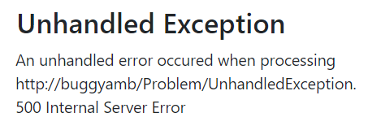

<h1>Quick Tour</h1>

>Applies to: BuggyAmb V1

When you first browse the BuggyAmb application you should see the following Welcome Page:

The problem scenarios are under "Problem Pages". If you click Problem Pages link you will see the following screen:

The <code>content area</code> is where you see the results when you click a link.

Links for the problem scenarios are located on the left pane along with a link to the "working" scenario and a link to an experimental "load generator" page.

<code>Expected Results</code>, as its name suggests, is the page which is working fine. You can use this page to compare the results with the slow scenarios. You may sometimes see that the "expected results" would also take longer than expected when you reproduce problems with other pages so this page may be affected because of other problems happening in the application. See it in action in the screenshot below, do you see how fast it loads under a second?

<h2>Performance Problem Scenarios</h2>

BuggyAmb is a very slow application.

<code>Slow</code> scenario is where things start going wrong. When you click the link you should see that loading the same content takes much more than the fast one:

Things go weirder if you run the <code>Slow 2</code> or <code>Slow 3</code> scenarios. In those scenarios the page keeps loading but never finishes:

When you reproduce these issues first check the event logs. Do you see any symptom about the problem? You may see that the IIS WAS sevice thinks that the process is unhealthy and you may be seeing some signs that the process is restarted by WAS service again. Of course these are logged if you host BuggyAmb on IIS.

You may want to approach these kind of performance problems by checking how long it takes for the application to process the requests. If you are on IIS, you have IIS logs or FREB logs, and you can also look at the active running requests by using IIS Manager => Worker Processes window.

If you host it on Linux behind an Nginx or Apache server then you may want to check the web server logs to see how long it takes for the application to process the requests.

A good approach would be to check the performance counters to undertstand what is unexpected: is CPU / memory usage high? Are exceptions increasing? Is there any race condition symtpoms? etc...

However all of those information will most probably give you a big picture about the problem.

You may want to troubleshoot these performance issues by analyzing memory dumps or profiler traces.

<h2>Crash Problem Scenarios</h2>

BuggyAmb is not only slow but also does crash because of different reasons.

If you click <code>Crash 1</code> scenario you may confuse it with a performance problem because it may show you what you see with Slow 2 or Slow 3 scenarios - page keeps loading but never finishes:

If you try to capture manual memory dumps mostly suitable for performance issues, you may not get what you want because this is actually not a performance problem.

Also you may see the following errors if you make requests to any other page when you run this scenario. I made a few requests to home page and the expected results page in new browser tabs when I run this scenario and eventually I ended up with this page:

You may want to open task manager before running this scenario and see if the process ID changes. If it is changing then either the process is crashed or the process is restarted by the "system", e.g.: by WAS service if BuggyAmb is hosted on IIS.

You can review the "event logs" if you are on Windows and "journal logs" if you are on Linux to see if there is any information about the problem.

You may need to capture a crash dump to troubleshoot this problem.

<h2>The other scenarios</h2>

The <code>Handled Exception</code> and <code>Unhandled Exception</code> scenarios are self-explanatory. If you click <code>Handled</code> one you will this:

And you will see this if you click the <code>Unhandled</code> one:

