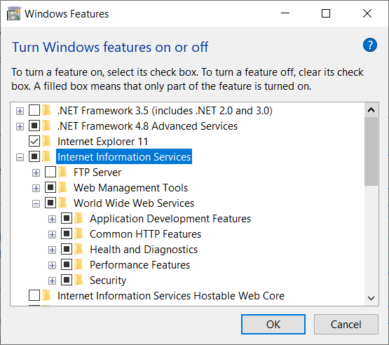

<h1>Windows Installation Instructions</h1>

<h2>.NET Core version</h2>

BuggyAmb is an ASP.NET Core framework-dependent application so it means that the correct version of ASP.NET Core runtime (or IIS Hosting Bundle) should be installed on your machine.

The main reason for not publishing BuggyAmb as a self-contained application was simple: the size of the package would be much higher than the framework-dependent one when it is deployed as self-contained application because the .NET Core libraries required to run the application will also be shipped with the application. If you want to deploy BuggyAmb as a self-contained application then you can download the source code and publish like that.

Please check the release information to find out which .NET Core version is required to run that release. The initial release of BuggyAmb is an ASP.NET Core 3.1 application so you will need .NET Core 3.1 runtime / SDK / IIS hosting bundle.

If you are going to host BuggyAmb on IIS then I recommended you to install the IIS Hosting Bundle which includes both 32bit and 64bit versions of .NET Core runtime and IIS support (ASP.NET Core Module - ANCM).

You can run the following command on command prompt to see which versions are installed on your machine:

> dotnet --info

To install .NET Core SDK, Runtime or IIS Hosting Bundle, visit https://dotnet.microsoft.com/download/dotnet-core/.

If you are using the first release of BuggyAmb then you need .NET Core 3.1: https://dotnet.microsoft.com/download/dotnet-core/3.1.

Once again, please install IIS Hosting Bundle if you are going to host BuggyAmb on IIS.

<h2>How to run BuggyAmb</h2>

You can run BuggyAmb as a standalone application or you can host it on IIS. 

<h3>Running as standalone application (no web server is needed)</h3>

This is the easiest way to run BuggyAmb if you don't want to install IIS. However in this case you will need to manage the process startup. Also note that the BuggyAmb application is "buggy" and it will most probably crash due to different reasons. Although this is one of the purposes of this application (investigating crash problems), you may need to start your application once again after it crashes. If you want to automate process management then go with hosting on IIS instructions.

Here are the instructions to run BuggyAmb as a standalone application:

* Download the latest release here: https://github.com/ahmetmithat/buggyamb/releases/
* Extract it to a folder.
* Open a command prompt and change directory to the installation folder.
* You can run the BuggyAmb application by running <code>dotnet BuggyAmb</code> command. BuggyAmb application will run on Kestrel and listen HTTP requests on port 5000:   
* In this case BuggyAmb application will run in a dotnet.exe process:   
	
You will need to find the PID on your environment like above to investigate the correct process.

As an alternative, you can run as a standalone by just running <code>BuggyAmb.exe</code> on command prompt. If you run that way then the BuggyAmb will run in (surprise surprise) BuggyAmb.exe process and you would need to investigate that process.

If you need to configure HTTPS or run on another port then you can download the source code and  make the necessary changes based on your needs easily. 

<h3>Hosting on Internet Information Services (IIS)</h3>

Hosting on IIS is easy and I would choose this option over running as a standalone application. This is because:

* IIS will manage the process startup: WAS service will restart the process once it crashes unless the application crashes frequently and the pool is disabled due to Rapid Fail Protection.
* Hosting on IIS is usually the preferred way for hosting ASP.NET Core appliations on Windows so this is closer to the real world scenarios. So you would see symptoms that applies to more real scenarios while doing troubleshooting.

<h4>Installing IIS</h4>

IIS is part of the Windows operating system and it can be installed at Control Panel\Programs\Programs and Features window by clicking "Turn Windows features on or off" on client Windows operating systems such as Windows 10. Default installation of IIS should be enough for hosting ASP.NET Core applications:br/> 

If you are on a server SKU, such as Windows Server 2019, you can install the IIS by adding the web server role in Server Manager. You can follow the instructions given in https://www.thebestcsharpprogrammerintheworld.com/2016/06/07/lab-1-install-iis-and-create-a-web-site/ if you need help.

After installation is completed you should be able to see the welcome page of IIS when you browse http://localhost/. If you don't get it, then something should be wrong.

<h4>Creating BuggyAmb web site on IIS</h4>
