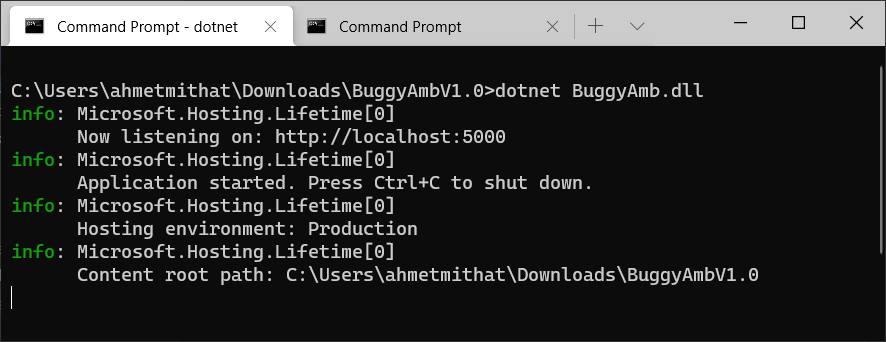
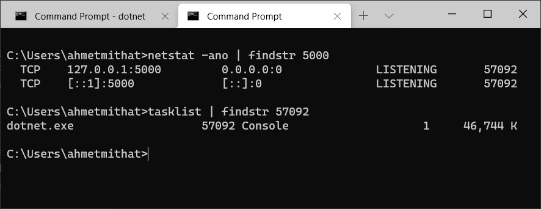

<h1>Windows Installation Instructions</h1>

Current release is an ASP.NET Core 3.1 framework-dependent application so it means that you have to install ASP.NET Core 3.1 Runtime on the server.

The main reason for not publishing it as a self-contained application is simple: the size of the package will be much higher than the framework-dependent one. If you want to deploy BuggyAmb as a self-contained application then you can download the source code and publish with that option.

You can run BuggyAmb as a standalone application or you can host it on IIS. If you are going to host BuggyAmb on IIS then we recommended installing the Hosting Bundle which includes the both 32bit and 64bit versions of .NET Core Runtime and IIS support (ASP.NET Core Module - ANCM).

To install .NET Core 3.1 / ASP.NET Core 3.1 visit https://dotnet.microsoft.com/download/dotnet-core/3.1.

You can run the following command on command prompt to see which versions are installed on your machine:

> dotnet --info

<h2>Standalone Application</h2>

This is the easiest way to run BuggyAmb if you don't want to install / use IIS. However in this case you will need to manage the process startup. Also note that the BuggyAmb application is "buggy" and it will most probably crash due to different reasons. Although this is one of the purposes of this application (investigating crash problems), you may need to start your application once again after it crashes. If you want to automate process management then go with hosting on IIS instructions.

Here are the instructions to run BuggyAmb as a standalone application:

* Download the latest release here: https://github.com/ahmetmithat/buggyamb/releases/
* Extract it to a folder.
* Open a command prompt and change directory to the installation folder.
* You can run the BuggyAmb application by running <code>dotnet BuggyAmb</code> command. BuggyAmb application will run on Kestrel and listen HTTP requests on port 5000:    
* In this case BuggyAmb application will run in a dotnet.exe process:    
	
You will need to find the PID on your environment like above to investigate the correct process.

As an alternative, you can run as a standalone by just running <code>BuggyAmb.exe</code> on command prompt. If you run that way then the BuggyAmb will run in (surprise surprise) BuggyAmb.exe process and you would need to investigate that process.

If you need to configure HTTPS or run on another port then you can download the source code and  make the necessary changes based on your needs easily. 

<h2>Hosting on IIS</h2>

Hosting on IIS is easy and I would choose this option over running a standalone applicaiton. This is because:

* IIS will manage the process startup: WAS service will restart the process once it crashes unless the application crashes frequently and the pool is disabled due to Rapid Fail Protection.
* Hosting on IIS is usually the preferred way for hosting ASP.NET Core appliations on Windows so this is closer to the real world scenarios.